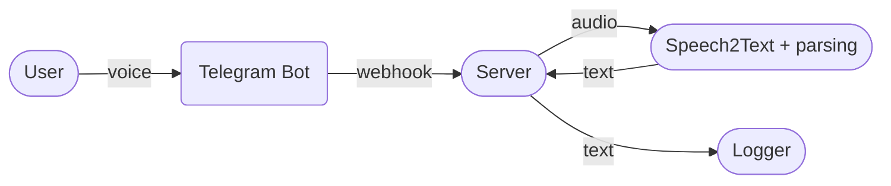

# Logger Bot

A Telegram bot that accepts voice messages, transcribes them using OpenAI Whisper, and parses workout data (exercise, reps, weight) for logging to a Google Sheet.

## Architecture



## Requirements

- [`uv`](https://github.com/astral-sh/uv) package manager
- A Telegram bot token (from [@BotFather](https://t.me/BotFather))

## Setup

1. **Install dependencies**
   ```bash
   uv sync
   ```

2. **Configure the bot token**

   Create a `.env` file in the project root:
   ```
   TELEGRAM_API_TOKEN=your_telegram_bot_token_here
   ```

3. **Configure Google Sheets access**

   Place your service account key file at the project root as `credentials.json`, and share the `"Logueala"` spreadsheet with the service account email.

## Running the bot

```bash
python src/logger_bot/main.py
```

The bot will listen for voice and audio messages. When it receives one, it downloads the file, transcribes it with Whisper, and replies with the transcription.

## Viewing Your Log Data as a Table (launch_db_view)

You can view your `log.csv` data as a searchable, filterable table in your web browser using [Datasette](https://datasette.io/):

**Launch the database view locally**
   ```bash
   ./launch_db_view.sh
   ```
   This script:
   - Imports your latest `log.csv` into a SQLite database called `log.db` (table: `logs`).
   - Starts a local Datasette server.

3. **Open your browser** to [http://127.0.0.1:8001](http://127.0.0.1:8001) — you'll see your workouts as an interactive table.

You can search, sort, and filter columns right from this UI.


## Project structure

```
src/logger_bot/
├── main.py     # Bot entry point and Telegram handler
├── model.py    # Whisper transcription and workout data extraction
├── storage.py  # Google Sheets integration (not yet wired in)
launch_db_view.sh   # Script to create a SQLite DB from log.csv and view with Datasette
```
