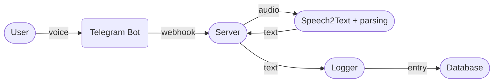
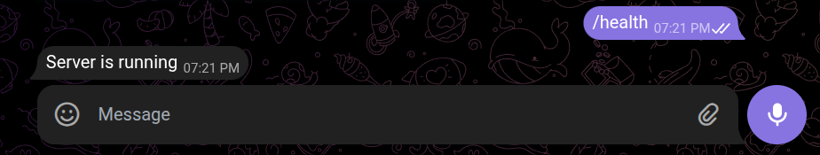
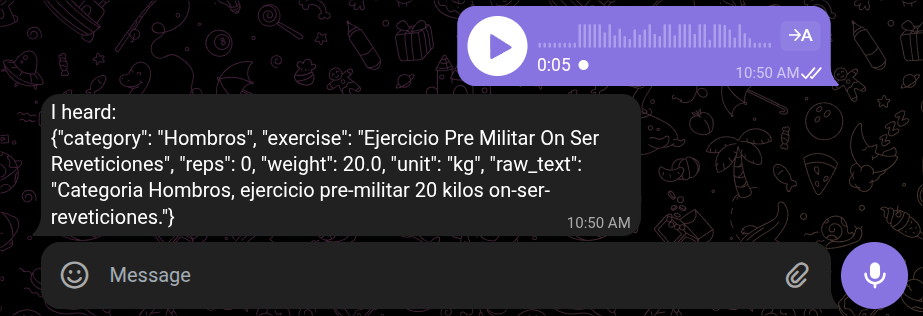
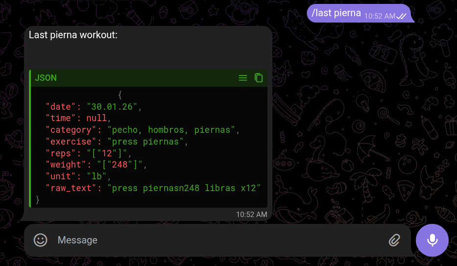
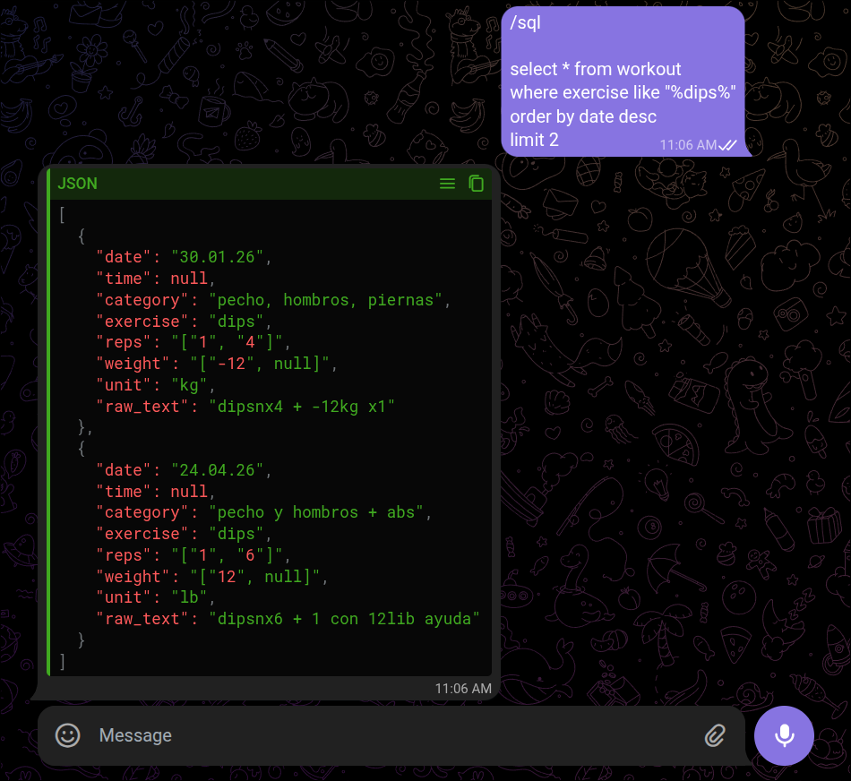

# Logger Bot

A Telegram bot that accepts voice messages, transcribes them, and parses workout data (exercise, reps, weight) for logging to a csv or database.

## Architecture



## Requirements

- [`uv`](https://github.com/astral-sh/uv) package manager
- A Telegram bot token (from [@BotFather](https://t.me/BotFather))

## Setup your bot server using `uv` 
1. **Configure the bot token**
[Create a bot](https://core.telegram.org/bots/tutorial#introduction) using Telegram's `@BotFather`.
Grab your token and create a `.env` file in the project root with it like this:
```
TELEGRAM_API_TOKEN=your_telegram_bot_token_here
```

2. **Launch Server**
Make sure you have [uv](https://docs.astral.sh/uv/getting-started/installation/) installed in your machine.

Run this on your terminal (at project root level):
```bash
./run_server.sh
```
That will set up the venv, install dependencies and launch the server that communicates with your telegram bot.

You can healthcheck the server typing `/health` on your telegram bot chat and see this:


## Using the bot
The bot will listen for voice, messages and commands (start with `/`).

You can send a voice message describing your workout. 
The bot transcribes it, parses the result, and logs it into the database/csv file.
The bot understands natural language, for example, you can say:

- *"Press de banca, 10 repeticiones, 80 kilos, categoría pecho"*
- *"Sentadilla 5 reps 100 kg"*
- *"Shoulder press 8 repetitions 60 lbs"*



### Bot Commands
These are the commands
- `/last <exercise>`: Returns the most recent logged set for a given exercise, as a JSON code block, for example `/last sentadilla`.




- `/sql <query>`: Runs a SQL query against `log.db` and returns the results as a JSON code block. The connection is read-only, so only `SELECT` statements work, for example:




**Launch the database view**
You can visualize your database and run queries against it using a UI.
Run this command to launch the UI:
```bash
./launch_db_view.sh
```

This script:
- Imports your latest `log.csv` into a SQLite database called `log.db` (table: `logs`).
- Starts a local Datasette server.

Open your browser on [http://127.0.0.1:8001](http://127.0.0.1:8001) — you'll see your workouts as an interactive table with an SQL interface to interact with it.

## GPU Support on the server
The server detects automatically available GPU on the machine and uses it to compute run the neural network computation (Speech2Text), which makes it much faster.
